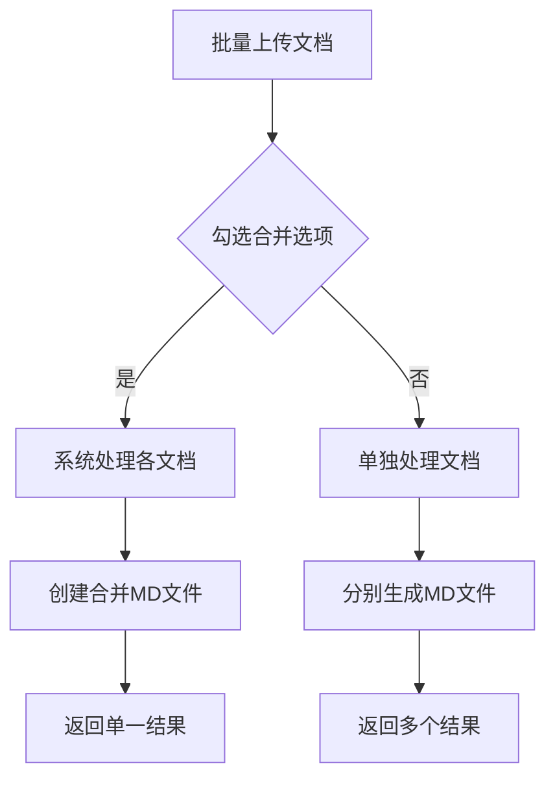

# 合并文档功能说明

## 功能概览

新增"合并所有文档到单个文件"选项，允许用户将批量上传的文档文件合并到一个统一的 Markdown 文件中。

## 使用方法

### 📋 前端操作

1. **启用合并选项** -

   - 在"📝 提示词类型"配置面板中找到
   - 勾选"📄 合并所有文档到单个文件"

2. **上传多个文档**

   - 批量上传 PDF 或图片文件
   - 系统会自动检测是否启用了合并模式

3. **结果展示**
   - 合并模式下，只生成一个合并 MD 文件
   - 文件名格式：`合并文档_20231201_143022.md`

### 🔧 后端逻辑

1. **合并逻辑**：

   ```python
   if merge_output and results:
       # 创建合并文档头部
       # 为每个文档添加独立章节
       # 保存到单一MD文件
   ```

2. **文档结构**：

   ```markdown
   # 合并文档处理结果

   处理时间：2023-12-01 14:30:22
   处理文档数量：X 个

   ---

   # 1. document1

   **原始文件：** [filename1.pdf](/uploads/filename1.pdf)

   [文档内容 1]

   ---

   # 2. document2

   **原始文件：** [filename2.jpg](/uploads/filename2.jpg)

   [文档内容 2]
   ```

## 核心特性

### ✅ 功能特点

- **自动文档编号** - 按上传顺序依次编号
- **原始文件链接** - 每个文档包含指向`/uploads/`的文件链接
- **清晰文档分割** - 用`---`分隔不同文档内容
- **时间戳记录** - 自动记录处理时间和文件数量
- **格式保持** - 保留原文档的 Markdown 格式化

### 🎯 适用场景

- **批量发票处理** - 一次性处理多个发票到统一文档
- **多文档汇总报告** - 将多个报告合并生成综合分析
- **项目文档归档** - 合并相关项目文档便于项目管理
- **会议纪要整理** - 将多页扫描文档汇总成完整纪要

## 技术实现

### 前端修改

1. **HTML 结构**：在提示词配置区域增加合并选项 checkbox
2. **JavaScript 逻辑**：在 FormData 中增加`merge_output`参数
3. **UI 样式**：为合并选项添加醒目的视觉效果

### 后端修改

1. **API 参数**：新增`merge_output: bool = Form(False)`
2. **处理逻辑**：检测合并模式并创建统一文档
3. **文档生成**：构建结构化合并结果

### 文件映射

- `/web/index.html` - 添加前端 UI 组件
- `/web/app.js` - 传递合并参数至后端
- `/web/style.css` - 美化合并选项样式
- `/server/main.py` - 核心合并逻辑实现

## 使用示例

### 使用流程



### 代码示例

```javascript
// 前端勾选状态检查
const mergeOutput = document.getElementById("merge_output");
form.append("merge_output", mergeOutput.checked);
```

```python
# 后端合并处理
if merge_output and results:
    merged_content.append("# 合并文档处理结果\n\n")
    for idx, result in enumerate(results, 1):
        # 生成合并文档内容
```

此功能极大地提升了批量文档处理的便捷性，特别适合需要汇总报告的场景使用。
